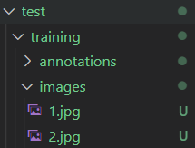
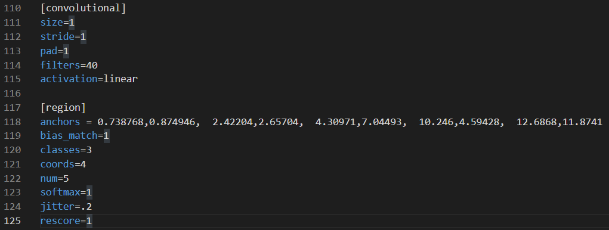

# 객체 인식

## DarkFlow

- Tensorflow 기반 YOLO모델 프레임워크

### Train

#### 사전 준비

해당 폴더에 샘플 파일이 존재해 이를 활용




`labels.txt`

- 위의 이미지는 3개의 class가 있다.(annotations 폴더에서 확인 가능)

```
person
bicycle
horse
```

`cfg/tiny-yolo_copy.cfg`

- tiny-yolo.cfg 를 copy한 것(원본 모델을 그대로 유지시키기 위해)
- tiny-yolo는 경량 yolo모델임.



120번째줄에 classes를 3으로, filters를 5*(5+class_num) = 40으로 수정

`bin/tiny-yolo.weights`

https://github.com/digitalbrain79/pyyolo/blob/master/tiny-yolo.weights

여기서 파일을 받아 bin 폴더안에 위치, 60Mb로 용량이 크다.

#### 학습

- 처음 학습 시작하는 경우

  ```Shell
  $ python flow --model ./cfg/tiny-yolo_copy.cfg --labels ./labels.txt --trainer adam --dataset ./test/training/images/ --annotation ./test/training/annotations/ --train --summary ./logs --batch 1 --epoch 100 --keep 5 --lr 1e-04 --gpu 0.5
  ```

  - `model` : 어떤 모델을 사용할지

  - `labels` : target class 정보가 담긴 txt파일

  - `trainer` : optimizer

  - `dataset` : 이미지 데이터들의 위치

  - `annotation` : 객체의 위치가 담긴 xml 파일들의 위치

  - `train` : 학습을 한다는 옵션

  - `summary` : 모델 학습 로그

  - `batch` : batch size. 여기서는 이미지가 2개밖에 없으므로 batch size를 1로 설정

  - `epoch` : 전체 이미지를 몇번 학습 할지

  - `keep` : early stop 때문에 loss가 개선되지않으면 자동으로 학습을 멈춘다. keep 5는 최소 5번은 그래도 epoch를 돌린다는 의미

  - `lr` : learning rate, 학습과정에서 parameter를 변화하는 정도. 값이 작을수록 학습속도가 느려짐. 1e-04는 0.0001이다.

  - `gpu` : gpu의 몇%를 쓸것인지. 0~1까지 설정 가능

    

- 학습된 모델을 이어서 학습하는 경우

  load 옵션을 주면 된다.

  ```Shell
  $ python flow --model ./cfg/tiny-yolo_copy.cfg --labels ./labels.txt --trainer adam --dataset ./test/training/images/ --annotation ./test/training/annotations/ --train --summary ./logs --batch 1 --epoch 100 --keep 5 --lr 1e-04 --gpu 0.5 --load -1
  ```

  - `load` : 이전 모델의 몇번째 epoch에서 시작할 것인지. -1이면 가장 최근 epoch를 받아옴

    

- 사전학습 weights를 사용하고 싶은 경우

  weights 파일을 로드해 사용하면 된다.

  ```Shell
  $ python flow --model ./cfg/tiny-yolo_copy.cfg --labels ./labels.txt --trainer adam --dataset ./test/training/images/ --annotation ./test/training/annotations/ --train --summary ./logs --batch 1 --epoch 100 --keep 5 --lr 1e-04 --gpu 0.5 --load ./bin/tiny-yolo.weights
  ```

  - `load` : weights 파일


### Detection(Predict)

- 이미지 파일로 예측

  ```Shell
  $ python flow --model ./cfg/tiny-yolo_copy.cfg --imgdir ./test/training/images/ --labels ./labels.txt --load -1 --threshold 0.3
  ```

  `threshold` : 0~1사이값. 어떤 값 이상이어야 객체로 판단할지, 이 값이 작을수록 bounding box가 많아짐

  위 코드를 실행시키면 `test/training/images/out` 폴더에 다음과 같은 사진을 얻을 수 있다.

  

- Json 파일로 객체 위치 저장

  ```Shell
  python flow --model ./cfg/tiny-yolo_copy.cfg --imgdir ./test/training/images/ --labels ./labels.txt --load -1 --threshold 0.3 --json
  ```

  실행시키면 마찬가지로 `test/training/images/out` 폴더에 다음과 같은 json파일을 얻을 수 있다.

  `1.json`

  ```Shell
  [{"label": "person", "confidence": 0.79, "topleft": {"x": 141, "y": 8}, "bottomright": {"x": 220, "y": 198}}, {"label": "bicycle", "confidence": 0.86, "topleft": {"x": 102, "y": 79}, "bottomright": {"x": 227, "y": 251}}]
  ```

  

### Save 

해당 모델을 tensorflow 파일 형태로 저장(pb + meta)

- `pb` : parameter 값들을 의미하는듯(?)

- `meta` : 모델의 구조를 정의

```shell
$ python flow --model cfg/tiny-yolo_copy.cfg --load -1 --savepb
```

`build_graph` 폴더에 저장됨


## Label_image

`label_image`

- 이미지 불러와서 객체 위치 저장하는 프로그램
- xml형태로 저장됨


## 겪은 문제들

### 설치 과정 중 에러

1. `cl.exe' failed: No such file or directory` : C++ 환경이 구축되어있지않아 문제 발생 -> Visual Studio로 C++ 설치

2. `tensorflow.contrib` 문제 : tensorflow version 2를 사용해서 발생한 문제 -> Python 버전을 3.6으로 낮추고, tensorflow 1.14를 설치해 해결

### 모델 성능

1. 처음에 사전학습 weights를 사용하지않고 yolo를 학습하니까 성능이 너무 안좋게 나옴 -> tiny-yolo.weights 사용, 아마 학습할 이미지가 너무 적어서(2개) 발생한 문제일수도 있음


